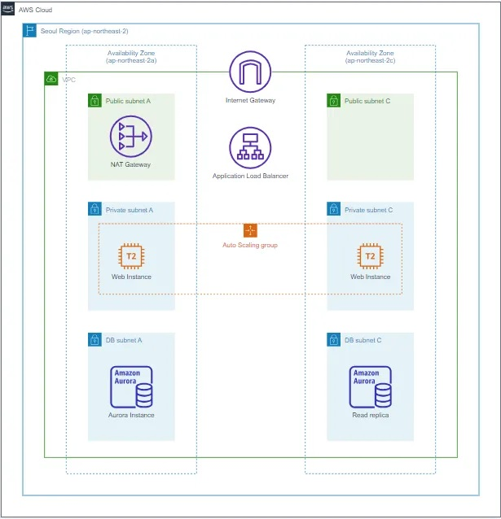
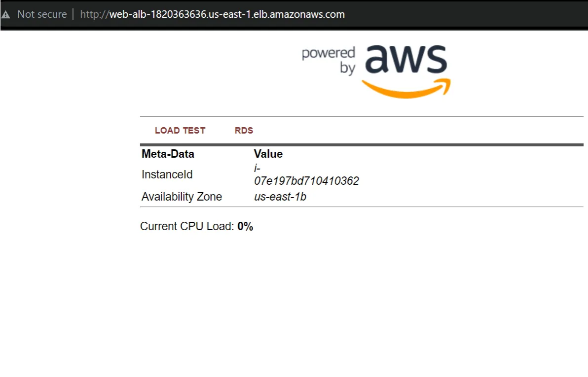

# Scalable Web Application with ALB and Auto Scaling

This project demonstrates a full-fledged AWS environment setup for deploying a scalable, secure, and robust web application. It includes VPC setup, EC2 configuration, custom AMIs, Load Balancer, Auto Scaling Group, RDS integration, and Secrets Manager for credential management.

Link: http://web-alb-1820363636.us-east-1.elb.amazonaws.com


---

## Prerequisites

- AWS Account (Free Tier recommended)
- AWS Console Access or AWS CLI
- Basic knowledge of Linux and AWS services


## Diagram



---

## VPC Configuration

1. Navigate to **VPC** in AWS Console.
2. Create a new VPC with:
   - Name: `VPC-Lab`
   - CIDR: `10.0.0.0/16`
   - 2 Public Subnets: `10.0.10.0/24`, `10.0.20.0/24`
   - 2 Private Subnets: `10.0.100.0/24`, `10.0.200.0/24`
   - 1 NAT Gateway
   - DNS Hostnames & DNS Resolution: Enabled

---

## VPC Endpoint

- Create Gateway Endpoint for **S3** to private subnets.
- Policy: Full Access

---

## Launch Web Server (EC2)

1. Launch **t2.micro** EC2 in a public subnet of `VPC-Lab`.
2. Create SG `Immersion Day — Web Server` allowing HTTP (80) & SSH (22).
3. Use the following **user-data** to configure Apache, PHP, and download app:

```bash
#!/bin/sh
dnf install -y httpd wget php-fpm php-mysqli php-json php php-devel mariadb105-server php-mbstring
chkconfig httpd on
systemctl start httpd
cd /var/www/html && wget -O immersion-day-app-php7.zip "https://.../immersion-day-app-php7.zip" && unzip immersion-day-app-php7.zip
cd /var/www/html && mkdir vendor && cd vendor && wget https://docs.aws.amazon.com/aws-sdk-php/v3/download/aws.zip && unzip aws.zip
dnf update -y
```

---

## Session Manager Access

1. Create IAM Role: `SSMInstanceProfile`
   - Policy: `AmazonSSMManagedInstanceCore`
2. Attach to EC2 instance.
3. Use **Session Manager** to access EC2 via browser.

---

## Create Custom AMI

- Actions > Image and Templates > Create Image

---

## Application Load Balancer (ALB)

1. Create ALB with 2 public subnets from `VPC-Lab`.
2. SG: `web-ALB-SG` allowing HTTP.
3. Create Target Group: `web-TG`, target type: **Instances**, VPC: `VPC-Lab`.
4. Attach Target Group to ALB.

---

## Launch Template & Auto Scaling Group

1. Create SG: `web-ASG-SG` allowing HTTP from `web-ALB-SG`.
2. Create Launch Template:
   - AMI: Web Server V1
   - SG: `web-ASG-SG`
   - IAM: `SSMInstanceProfile`
3. Create Auto Scaling Group:
   - VPC: `VPC-Lab`
   - Subnets: Private Subnets
   - Target Group: `web-TG`
   - Desired: 2, Min: 2, Max: 4
   - Policy: CPU Utilization @ 30%

---

## RDS Database

1. SG: `db-SG` allowing MySQL from `web-ASG-SG`.
2. Create Aurora DB Cluster:
   - VPC: `VPC-Lab`
   - Subnet Group: New
   - SG: `db-SG`
   - Initial DB: `app-db`

---

## Secrets Manager

1. Store DB credentials with name `rdscluster-secret`.
2. Add `GetSecretValue` policy to `SSMInstanceProfile`.
3. Attach to EC2 instances.

---

## Validate Web App

- Visit ALB DNS.
- Test "Load" to trigger scaling.
- Monitor metrics in CloudWatch.


---

## Conclusion

This setup equips you with hands-on experience in:
- VPC networking
- Secure web hosting
- Auto Scaling & Load Balancing
- Database provisioning
- Secret management


